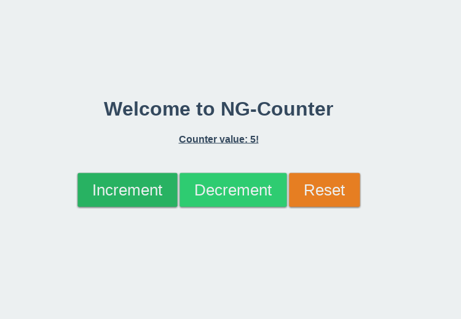

# NG5-Counter

A simple [Angular5](https://angular.io/) / [Redux](https://redux.js.org/) project which represents a little part of my professional skills and abilities to work with this stuff
 

## Requirements
* node `^4.5.0`
* yarn `^0.17.0` or npm `^3.0.0`

## Development server

Run `npm start` or `yarn start` for a dev server. Navigate to `http://localhost:8080/`.
## Build

Run `npm run build` or `yarn run build` to build the project. The build artifacts will be stored in the `dist/` directory. Use the `-prod` flag for a production build.

## Running unit tests

Run `npm run test` or `yarn run test` to execute the unit tests via [Karma](https://karma-runner.github.io).

## Running end-to-end tests

Run `npm run e2e` or `yarn run e2e` to execute the end-to-end tests via [Protractor](http://www.protractortest.org/).
